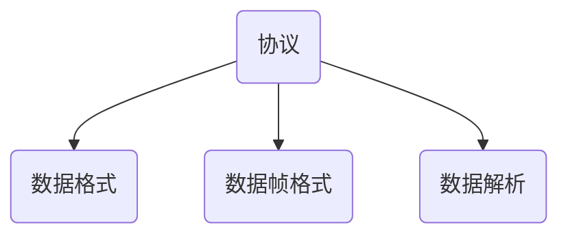
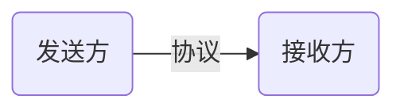

# 协议

只有 0 和 1 的约定仍然无法构成通信，还记得我们的第二个问题吗？想象一下，你向一个人说：”你好！“，但由于对方听不懂中文，所以无法理解你的意思。在计算机的世界中也是如此，你按照你的约定发送了有意义的二进制流，但对方无法解析，因为他不知道你的约定。

协议是为了解决这一问题而产生的，所谓的协议是一种约定，约定双方该以何种方式发送、解析数据（即发生通信的主体和客体之间如何交流）。

本节课中，我们对通信的学习，实际上就是对通信协议的学习。在本节课程中，我们会介绍一些通信协议的基本概念，以及一些常见的通信协议。

::right::

