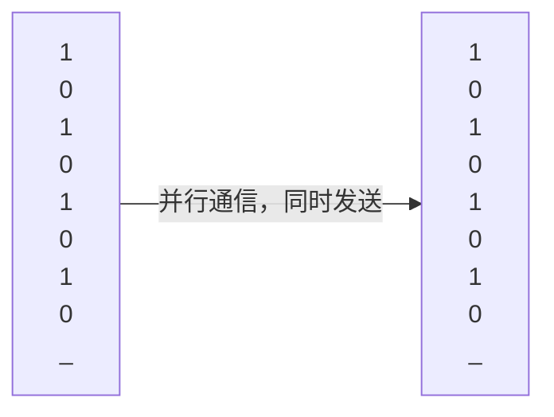
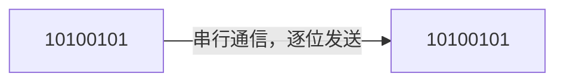

# 通信协议 - 串行与并行

一个通信协议往往会规定用于通信的线路数量，这些线路一部分用于传输数据，一部分用于控制通信的流程，我们根据传输数据的线路个数将通信协议分为串行和并行两种。

- 串行通信：数据通过一根线路逐位传输，传输速度慢，但是线路简单，适合远距离通信。
- 并行通信：数据通过多根线路同时传输，传输速度快，但是线路复杂，适合短距离通信。

单片机的绝大多数通信方式都是串行通信，因为单片机的引脚数量有限，无法支持并行通信。

::right::

 

