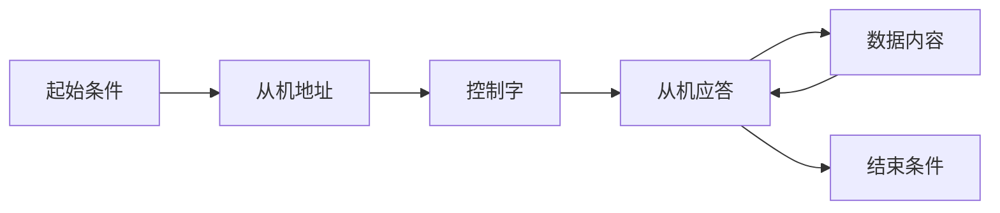

# I2C 协议

I2C通信是一种经典的同步通信协议，它使用`SDA`数据线和`SCL`时钟线进行通信，通信双方需要通过`SCL`同步时钟信号。

不同于 UART 的点对点传输，I2C 通信以“一主多从”的模式进行，主机掌握通信的主导权，各个从机与主机的`SDA`和`SCL`相连，并通过“从机地址”来区分不同的设备。

对于一帧I2C数据，通常由以下几部分组成：

```mermaid

flowchart LR
  起始条件 --> 从机地址
  从机地址 --> 控制字
  控制字 --> 从机应答
  从机应答 --> 数据内容
  数据内容 --> 从机应答
  从机应答 --> 结束条件

```
